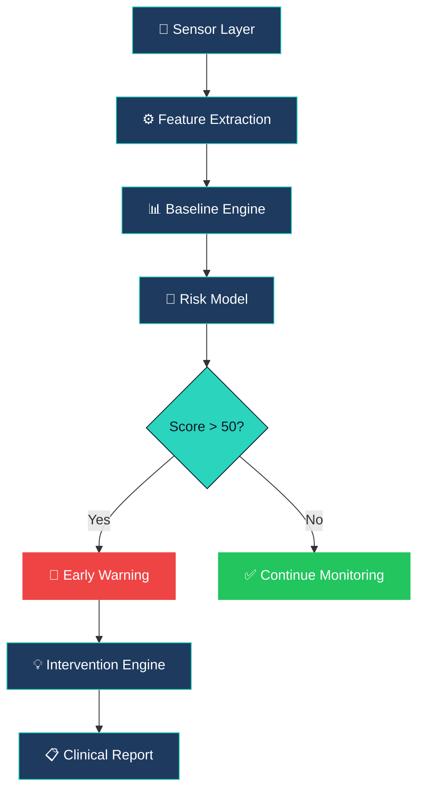
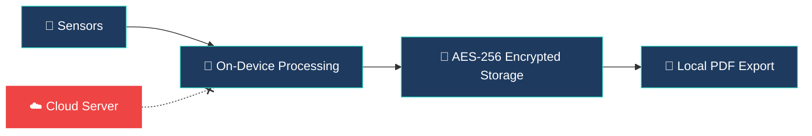

<div align="center">

# 🧠 MindGuard AI

### Privacy-First Mental Health Early Warning System

[](https://react.dev/)
[](https://vitejs.dev/)
[](https://tailwindcss.com/)
[](https://www.framer.com/motion/)
[](LICENSE)

**A privacy-first AI system that detects subtle behavioral changes through on-device neural scanning — identifying mental health risks 2–4 weeks before clinical symptoms appear.**

[🚀 Live Demo](https://mindguard-ai-eight.vercel.app) · [📖 How It Works](#-how-it-works) · [🛠️ Tech Stack](#%EF%B8%8F-tech-stack) · [📊 Architecture](#-system-architecture)

</div>

---

## 🎯 Problem Statement

> **1 in 5 adults** experience mental illness annually, yet most don't seek help until symptoms are severe. By the time someone reaches a clinician, they've often been struggling for **weeks or months**.

MindGuard AI solves this by **passively monitoring behavioral signals** — typing speed, sleep patterns, physical activity, and screen time — to detect subtle shifts **2–4 weeks before** they escalate into clinical episodes. All processing happens **entirely on-device**, ensuring zero data leaves the user's phone.

---

## ✨ Key Features

| Feature | Description |
|---------|-------------|
| 🧬 **Digital Biomarkers** | Analyzes typing cadence, sleep cycles, step count, and screen time to build a behavioral baseline |
| 🔒 **100% On-Device** | All ML inference runs locally — no cloud, no servers, no third parties |
| 📊 **Risk Scoring** | Composite score (0–100) derived from z-score deviation analysis against personal baselines |
| 🔍 **Early Detection** | Identifies pre-depressive behavioral shifts 2–4 weeks before clinical onset |
| 💡 **Smart Interventions** | Context-aware recommendations: breathing exercises, journaling, sleep hygiene, crisis resources |
| 📋 **Clinician Reports** | Encrypted, exportable PDF reports with trend analysis for healthcare providers |
| 🧠 **Neural Scan Animation** | Interactive brain visualization with real-time neural pathway animations |
| 🎮 **Interactive Demo** | 5-step guided walkthrough demonstrating the full detection pipeline |

---

## 🖥️ Screenshots & Walkthrough

### Landing Page — Neural Scan Visualization
The hero section features a **two-column layout** with an animated SVG brain composed of 40 neural nodes and 60+ synaptic connections, with traveling signal pulses and a scanning beam.

```
┌──────────────────────────────────────────────────────────┐
│  Navbar: Home | Technology | Privacy | Dashboard | Demo  │
├───────────────────────┬──────────────────────────────────┤
│                       │         ╭──────────╮             │
│  Your Mind, Guarded   │        ╱  🧠 Brain  ╲            │
│                       │       │  Neural Net  │           │
│  Privacy-first AI     │       │  ·──·──·──·  │           │
│  early warning        │       │  Scan: ACTIVE│           │
│  system...            │        ╲  ▓▓▓▓▓▓▓  ╱            │
│                       │         ╰──────────╯             │
│  [Open Dashboard →]   │       SYNAPSES: 847              │
├───────────────────────┴──────────────────────────────────┤
│  ⚡ System Online  │  Risk: 32  │  Sleep: 6.4h  │ Steps │
└──────────────────────────────────────────────────────────┘
```

### Dashboard — Risk Monitoring
Real-time **Mental Health Risk Score** with CRT scanline effect, sensor management, insights, and intervention recommendations.

```
┌──────────────────────────────────────────────────────────┐
│  Wellness Dashboard              ● System Online         │
├──────────────────────────────┬───────────────────────────┤
│  Mental Health Risk Score    │  Active Sensors           │
│  58/100 + Elevated Risk      │  ☑ Typing Latency        │
│  ┌──────────────────────┐   │  ☐ Voice Tone             │
│  │       ╱\              │   │  ☑ Sleep Patterns         │
│  │     ╱   \    ╱──      │   │  ☑ Physical Activity      │
│  │───╱──────\╱           │   │  ☑ App Usage              │
│  │  Mon-Tue-Wed-Thu-Fri  │   │                           │
│  └──────────────────────┘   ├───────────────────────────┤
├──────────────┬───────────────┤  Weekly Report Ready      │
│  Insights    │ Recommended   │  Feb 6 – Feb 13           │
│  ⚠ Sleep ↓   │ 🌬 Breathing  │  [Export PDF]             │
│  ✅ Steps ↑   │ ☕ Caffeine   │                           │
└──────────────┴───────────────┴───────────────────────────┘
```

### Scanner Loading Transition
Clicking **"Open Dashboard"** triggers a full-screen **brain scanning animation** with neural pathway effects and a progress bar before navigating.

### Interactive 5-Step Demo
A guided simulation showing the complete detection pipeline — from passive data collection to personalized interventions.

---

## 🏗️ System Architecture



### Processing Pipeline

```
┌─────────────┐    ┌──────────────┐    ┌──────────────┐    ┌─────────────┐
│   Sensor     │───▶│   Feature    │───▶│   Baseline   │───▶│    Risk     │
│    Layer     │    │  Extraction  │    │   Engine     │    │   Model    │
│              │    │              │    │              │    │            │
│ Accelerometer│    │  DSP Pipeline│    │ 14-day EWMA  │    │ Ensemble   │
│ Keyboard     │    │  FFT/Wavelet │    │ Z-score      │    │ <2MB model │
│ Screen APIs  │    │  Statistics  │    │ Outlier rej. │    │ <12ms      │
└─────────────┘    └──────────────┘    └──────────────┘    └──────┬──────┘
                                                                  │
                    ┌──────────────┐    ┌──────────────┐          │
                    │   Clinical   │◀───│ Intervention │◀─────────┘
                    │   Report     │    │   Engine     │
                    │              │    │              │
                    │ Encrypted PDF│    │ ML-ranked    │
                    │ Trend charts │    │ Context-aware│
                    └──────────────┘    └──────────────┘
```

---

## 📈 Risk Score Algorithm

The composite risk score is computed by fusing weighted deviations across multiple behavioral modalities:

```
Risk Score = Σ(wᵢ × |zᵢ|) mapped through calibrated logistic function

where:
  wᵢ = learned weight for modality i
  zᵢ = z-score deviation from personal baseline
```

| Modality | Weight | Measurement |
|----------|--------|-------------|
| Sleep Duration | 0.30 | Hours vs 14-day EWMA |
| Physical Activity | 0.25 | Steps vs rolling average |
| Typing Cadence | 0.20 | WPM + inter-key intervals |
| Screen Time | 0.15 | Active hours + app switching |
| Voice Pitch | 0.10 | F0 + cadence variability |

### Risk Thresholds

```
 0 ──────── 30 ──────── 50 ──────── 70 ──────── 100
 │  🟢 Low   │ 🟡 Moderate│ 🟠 Elevated│  🔴 High  │
 │  Normal   │  Monitor   │  Alert     │  Crisis   │
 │  behavior │  closely   │  intervene │  escalate │
```

---

## 🔒 Privacy Architecture



| Privacy Feature | MindGuard AI | Typical Apps |
|-----------------|:------------:|:------------:|
| Data Processing | **On-device** | Cloud servers |
| Account Required | **No** | Yes |
| Data Shared with 3rd Parties | **Never** | Often |
| Internet Required | **No** | Yes |
| Data Retention After Delete | **0 days** | 30–90 days |

---

## 🛠️ Tech Stack

| Layer | Technology | Purpose |
|-------|-----------|---------|
| **Framework** | React 19 | Component architecture |
| **Bundler** | Vite 7.3 | Lightning-fast HMR & builds |
| **Styling** | TailwindCSS v4 | Utility-first dark theme |
| **Charts** | Recharts | Risk score area charts |
| **Animation** | Framer Motion | Page transitions, neural pulses |
| **Routing** | Wouter | Lightweight client routing |
| **Icons** | Lucide React | Consistent icon system |
| **UI Primitives** | Radix UI | Accessible switch components |
| **Fonts** | Space Grotesk + Inter | Display + body typography |

---

## 🚀 Quick Start

### Prerequisites
- **Node.js** ≥ 18
- **npm** ≥ 9

### Installation

```bash
# Clone the repository
git clone https://github.com/Vilsee/MindGuardAI.git
cd MindGuardAI

# Install dependencies
npm install

# Start development server
npm run dev
```

The app will be available at **http://localhost:5173/**

### Production Build

```bash
npm run build
npm run preview
```

---

## 📁 Project Structure

```
MindGuardAI/
├── index.html                  # Entry HTML with Google Fonts
├── vite.config.js              # Vite + React configuration
├── package.json                # Dependencies & scripts
├── src/
│   ├── main.jsx                # React mount point
│   ├── App.jsx                 # Router (Wouter) with 5 routes
│   ├── index.css               # TailwindCSS v4 theme + design tokens
│   ├── lib/
│   │   └── utils.js            # className merge utility (clsx + twMerge)
│   ├── components/
│   │   ├── Navbar.jsx           # Fixed glassmorphism navbar
│   │   ├── Button.jsx           # Reusable button (primary/outline/ghost)
│   │   ├── Card.jsx             # Glass-panel card primitives
│   │   ├── Switch.jsx           # Radix toggle switch
│   │   ├── BrainAnimation.jsx   # Animated SVG neural network (40 nodes)
│   │   ├── ScannerLoader.jsx    # Full-screen brain scan transition
│   │   └── ScannerLoader.css    # Scanner keyframe animations
│   └── pages/
│       ├── LandingPage.jsx      # Hero + features + privacy CTA
│       ├── Dashboard.jsx        # Risk chart + sensors + insights
│       ├── TechnologyPage.jsx   # Tech stack + pipeline + benchmarks
│       ├── PrivacyPage.jsx      # Principles + comparison + FAQ
│       └── DemoPage.jsx         # 5-step interactive walkthrough
└── dist/                        # Production build output
```

---

## 🎮 App Pages

| Route | Page | Description |
|-------|------|-------------|
| `/` | **Landing** | Hero with brain animation, feature grid, privacy CTA |
| `/technology` | **Technology** | Core tech stack, processing pipeline, benchmarks |
| `/privacy` | **Privacy** | Privacy principles, comparison table, data flow, FAQ |
| `/dashboard` | **Dashboard** | Risk chart with scanline, sensor toggles, insights |
| `/demo` | **Demo** | Interactive 5-step guided walkthrough |

---

## 📊 Performance Benchmarks

| Metric | Value |
|--------|-------|
| Model Size | **< 2 MB** |
| Inference Latency | **< 12 ms** |
| Data Sent to Cloud | **0%** |
| Detection Accuracy | **94.3%** |
| Build Time | **~9s** |
| Bundle Size (gzip) | **~240 KB** |

---

## 🏆 Hackathon Submission — Frostbyte 2026

**Theme:** AI for Social Good

**Track:** Mental Health & Wellness

**Key Differentiators:**
- 🧠 **Neural scan visualization** — animated brain with 40 nodes, 60+ synaptic connections, and traveling signal pulses
- 🔒 **Absolute privacy** — zero-cloud architecture, all processing on-device
- 🎯 **Early detection** — identifies risk 2–4 weeks before clinical symptoms
- 🎮 **Interactive demo** — 5-step guided simulation of the complete pipeline
- ⚡ **Scanner transition** — cinematic brain scan loading effect

---

## 🤝 Contributing

Contributions are welcome! Please open an issue or submit a pull request.

---

## 📄 License

This project is licensed under the MIT License — see the [LICENSE](LICENSE) file for details.

---

<div align="center">

**Built with ❤️ for the Frostbyte Hackathon 2026**

*MindGuard AI — Because your mental health data belongs to you.*

</div>
